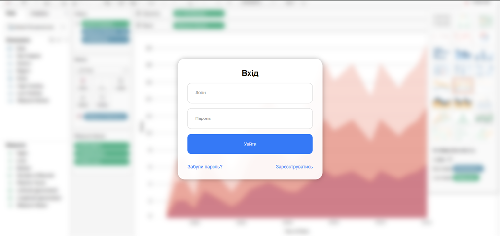
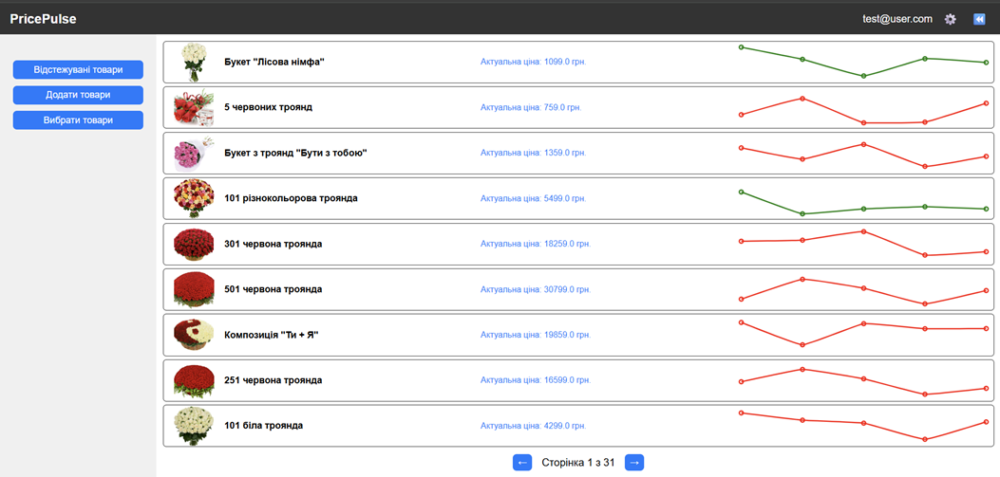
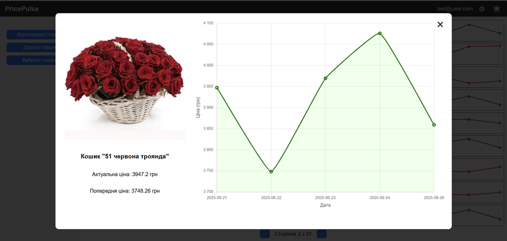

# Price Pulse: Flower Bouquet Price Tracker

Price Pulse is a web application designed to track and monitor price changes for flower bouquets from the website [flowers.ua](https://flowers.ua).  
It uses a **medallion architecture** (Bronze, Silver, Gold layers) for data processing, with web scraping for data ingestion, a **PostgreSQL database** for storage, **Flask** for the backend API, and a simple **JavaScript-based frontend** for user interaction. The **ETL pipeline** is orchestrated using **Apache Airflow**.

The system scrapes bouquet data daily, stores historical prices, and provides a user interface to view products, their price histories (with charts), add new products, and delete tracked items. It includes basic authentication (login/register) and pagination for product display.

---

## Table of Contents
- [Features](#features)
- [Technology Stack](#technology-stack)
- [Architecture Overview](#architecture-overview)
- [Installation](#installation)
- [Usage](#usage)
- [Screenshots](#screenshots)
- [Contributing](#contributing)
- [License](#license)

---

## Features
- **Web Scraping (Bronze Layer):** Automatically scrapes bouquet names, prices, photos, and IDs from flowers.ua using Selenium.
- **Data Transformation (Silver Layer):** Cleans and deduplicates scraped data, updates the database with new prices or product changes.
- **Data Views (Gold Layer):** Creates database views for easy querying of latest prices and historical data.
- **Backend API (Flask):** Provides endpoints for fetching products, price histories, adding/deleting products.
- **Frontend Interface:**
  - Displays paginated product cards with images, names, and current prices.
  - Shows price history charts using Chart.js.
  - Supports selection mode for bulk deletion.
  - Modal for adding new products via URL.
  - Basic login/register functionality (client-side simulation).
- **ETL Pipeline:** Scheduled daily via Airflow to run the Bronze → Silver → Gold process.
- **Database Management:** PostgreSQL with tables for products and price history, including indexes for performance.
- **Debugging and Logging:** Built-in logging in Flask and debug endpoints.

---

## Technology Stack
- **Backend:** Python 3.12+, Flask, psycopg2 (PostgreSQL driver)  
- **Database:** PostgreSQL  
- **Web Scraping:** Selenium, BeautifulSoup  
- **ETL Orchestration:** Apache Airflow  
- **Frontend:** HTML/CSS/JavaScript (with Chart.js for visualizations)  
- **Environment Management:** dotenv for secrets  
- **Other Libraries:** Requests, JSON, Pathlib, WebDriver Manager  

---

## Architecture Overview
The project follows a **medallion architecture** for data processing:

- **Bronze Layer (`bronze.py`):** Raw data ingestion via web scraping. Saves JSON files with scraped bouquet data.  
- **Silver Layer (`silver.py`):** Transforms raw data – cleans prices, checks for duplicates/updates, and inserts/updates into PostgreSQL tables.  
- **Gold Layer (`gold.py`):** Creates refined views for consumption (e.g., latest prices and history for graphs).  
- **ETL DAG (`etl_dag.py`):** Airflow DAG that sequences Bronze → Silver → Gold daily.  
- **Database Setup (`establishing_db.py`):** Initializes the database and tables.  
- **API Server (`app.py`):** Flask app serving data to the frontend.  

**Frontend Scripts:**
- `script_index.js`: Handles login, registration, and password reset (client-side).  
- `script_main.js`: Manages product display, pagination, charts, selection, and modals.  

**Data Flow:**
```
Scrape → Store Raw JSON (Bronze)
Transform & Load to DB (Silver)
Create Views (Gold)
API Queries Views → Frontend Displays Data
```

---

## Installation

### Prerequisites
- Python 3.12+  
- PostgreSQL (installed and running)  
- Apache Airflow (for ETL scheduling)  
- Google Chrome (for Selenium)  
- Node.js (optional, if extending frontend)  
- Git  

### Steps
1. **Clone the Repository**
   ```bash
   git clone https://github.com/yourusername/price-pulse.git
   cd price-pulse
   ```

2. **Set Up Environment Variables**  
   Create a `.env` file in the root directory with the following:
   ```env
   DB_NAME=price_pulse_db
   DB_USER=postgres
   DB_PASSWORD=your_password
   DB_HOST=localhost
   DB_PORT=5433
   ```

3. **Install Python Dependencies**
   ```bash
   pip install -r requirements.txt
   ```

4. **Set Up Database**
   ```bash
   python establishing_db.py
   ```

5. **Set Up Airflow**
   ```bash
   airflow db init
   airflow users create --username admin --password admin      --firstname Admin --lastname User --role Admin --email admin@example.com
   ```
   Place `etl_dag.py` in your Airflow DAGs folder (usually `~/airflow/dags`).  
   Start Airflow:
   ```bash
   airflow scheduler &
   airflow webserver
   ```

6. **Frontend Setup**  
   - No build step needed; serve static HTML/JS files (e.g., via Live Server in VS Code or directly open in browser).  
   - Ensure CORS is configured in Flask to allow requests from your frontend origin (default: `http://127.0.0.1:5500`).  

7. **Run the Flask API**
   ```bash
   python app.py
   ```
   The server will run on [http://0.0.0.0:5000](http://0.0.0.0:5000).

---

## Usage

- **Run ETL Pipeline:**  
  Trigger the DAG in Airflow UI: [http://localhost:8080](http://localhost:8080).  

- **Access the Frontend:**  
  Open `index.html` in a browser → log in (simulated; any credentials work).  
  On `main.html`, view tracked products, add new ones, select & delete, paginate, and view price charts.  

- **API Endpoints:**
  - `GET /api/products?page=1&per_page=9`
  - `GET /api/price_history/<product_id>`
  - `DELETE /api/delete_product/<product_id>`
  - `POST /api/add_product` (JSON body: `{product_id, bouquet_name, photo_url}`)
 

- **Debugging:**  
  - Flask logs → backend issues  
  - Airflow logs → ETL issues  
  - Browser console → JS errors  

---

## Screenshots
### Login Page


### Main Dashboard with Products


### Product Modal with Price Chart
 
  


---

## License
This project is licensed under the **MIT License**.  
